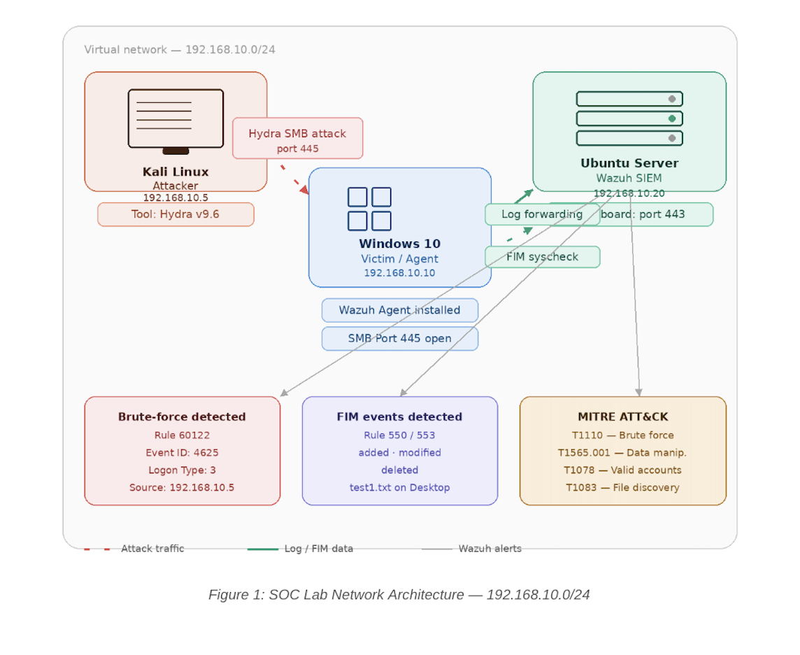
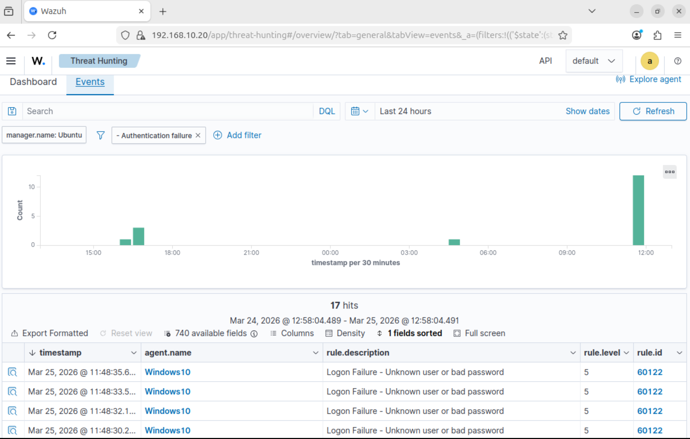
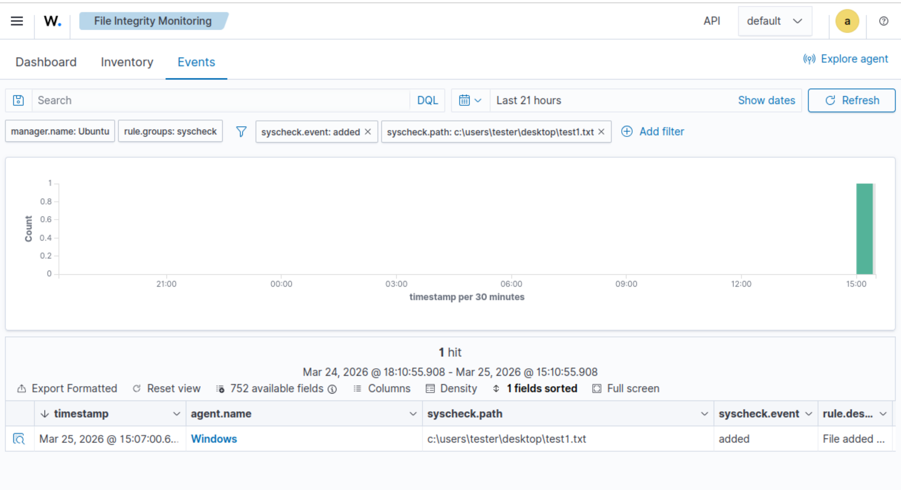
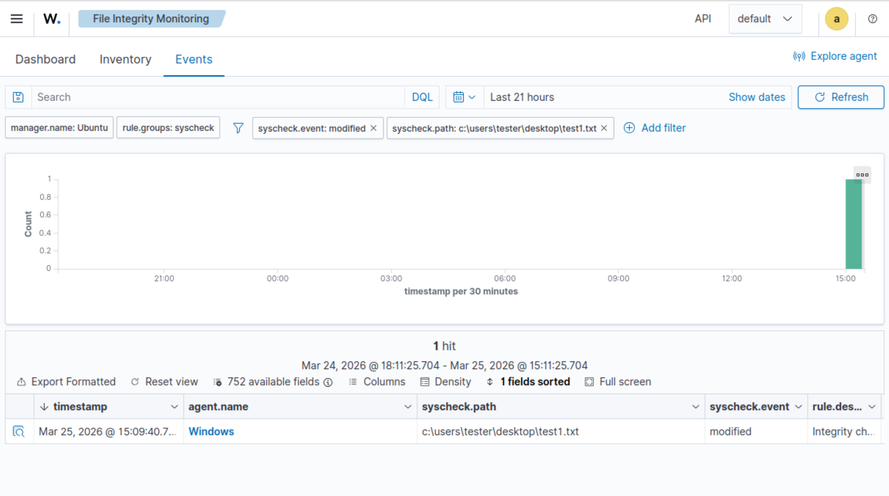
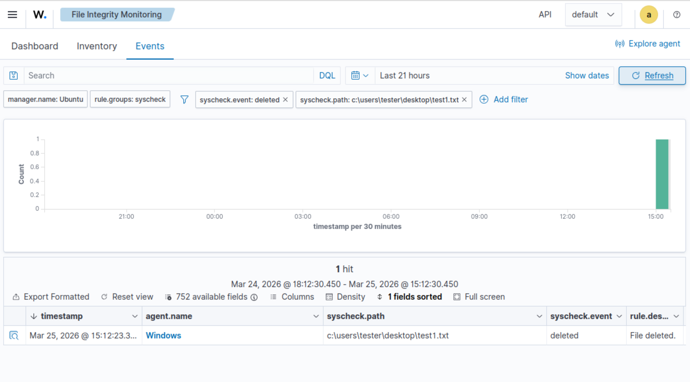
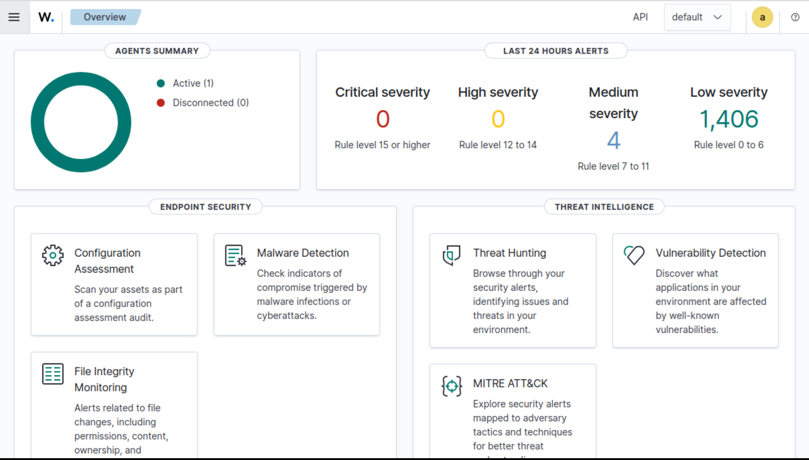

# 🔐 Wazuh SOC Lab – Brute Force Detection & File Integrity Monitoring

## 📌 Overview

This project simulates a real-world Security Operations Center (SOC) environment using Wazuh SIEM to detect brute-force attacks and monitor file integrity changes in real time. The lab demonstrates attack detection, log analysis, and threat monitoring.

---

## 🧱 Lab Setup

* Kali Linux (Attacker) – 192.168.10.5
* Windows 10 (Victim) – 192.168.10.10
* Ubuntu Wazuh Server – 192.168.10.20

---

## 🔍 Detection Logic

- Windows Event ID 4625 used to detect failed login attempts  
- Multiple failed logins attempts from same source indicate brute-force attack  
- File changes detected using Wazuh File Integrity Monitoring (FIM)  
- Alerts generated and analyzed in Wazuh dashboard

---

## ⚙️ Tools Used

* Wazuh SIEM
* Hydra
* VirtualBox

---

## 🚨 Use Cases

### 🔴 Brute Force Detection

* Hydra attack on SMB (port 445)
* Failed login detection (Event ID 4625)
* Alerts in Wazuh dashboard

### 🟡 File Integrity Monitoring (FIM)

* Monitoring critical files
* Detecting file modification & deletion
* Real-time alerts

---

## 📊 Detection

* Log sources: Windows Security Logs, Wazuh agent logs
* Authentication attacks detected
* File Integrity changes monitored

---

## 📸 Screenshots

### 🧱 Network Architecture

---

### 🔴 Brute Force Detection

---

### 🟡 File Integrity Monitoring (FIM)

#### ➕ File Added

#### ✏️ File Modified

#### ❌ File Deleted

---

### 🟢 Wazuh Dashboard

---

## 🛠️ Installation Guide

See `/setup-guide/installation.md`

---

## 📄 Report

[View Full Report](report/soc-lab-report.pdf)

---

## 🎯 MITRE ATT&CK

* T1110 – Brute Force
* T1565 – Data Manipulation

---

## 👨‍💻 Author

Rakesh (zeroday-studio)
